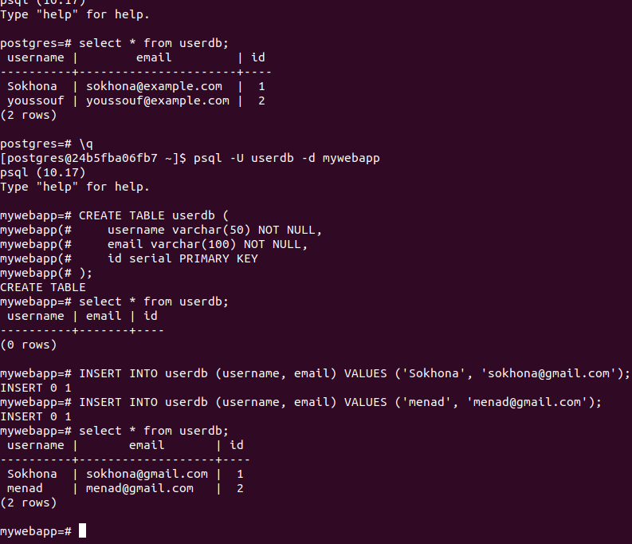

# 1 Script d'instalation centOS et server postgress
```sh
docker pull centos

docker run -it centos
 
cd /etc/yum.repos.d/

sed -i 's/mirrorlist/#mirrorlist/g' /etc/yum.repos.d/CentOS-*
sed -i 's|#baseurl=http://mirror.centos.org|baseurl=http://vault.centos.org|g' /etc/yum.repos.d/CentOS-*
yum update -y
 
yum install postgresql-server postgresql-contrib

su - postgres
 
initdb -D /var/lib/pgsql/data
 
pg_ctl start
 
psql
```

# 2 Création d'un utilisateur de base de données appelé "userdb" avec les rôles spécifiés :

```sh
CREATE ROLE userdb WITH SUPERUSER CREATEDB CREATEROLE LOGIN PASSWORD 'sokh';
```

# 3 Création de la base de données "mywebapp" 

```sh
CREATE DATABASE mywebapp;
```

# 3 . 1 Connexion à la base de données "mywebapp" en tant quutilisateur "userdb" :

```sh
psql -U userdb -d mywebapp
```

# 3 Création de la table "userdb" avec les colonnes spécifiées :

```sh
CREATE TABLE userdb (
    username varchar(50) NOT NULL,
    email varchar(100) NOT NULL,
    id serial PRIMARY KEY
);
```
# Requete INSERT 

```sh
INSERT INTO userdb (username, email) VALUES ('Sokhona', 'sokhona@gmail.com');
```

# Requete SELECT 

```sh
SELECT * FROM userdb;
```
# Visualisation :


